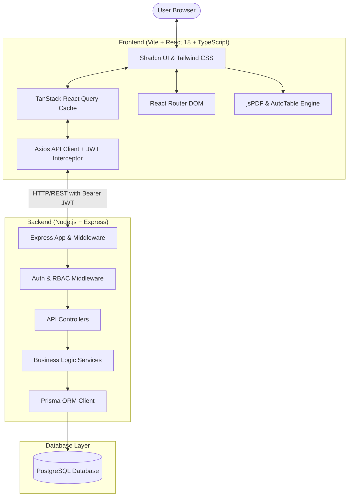
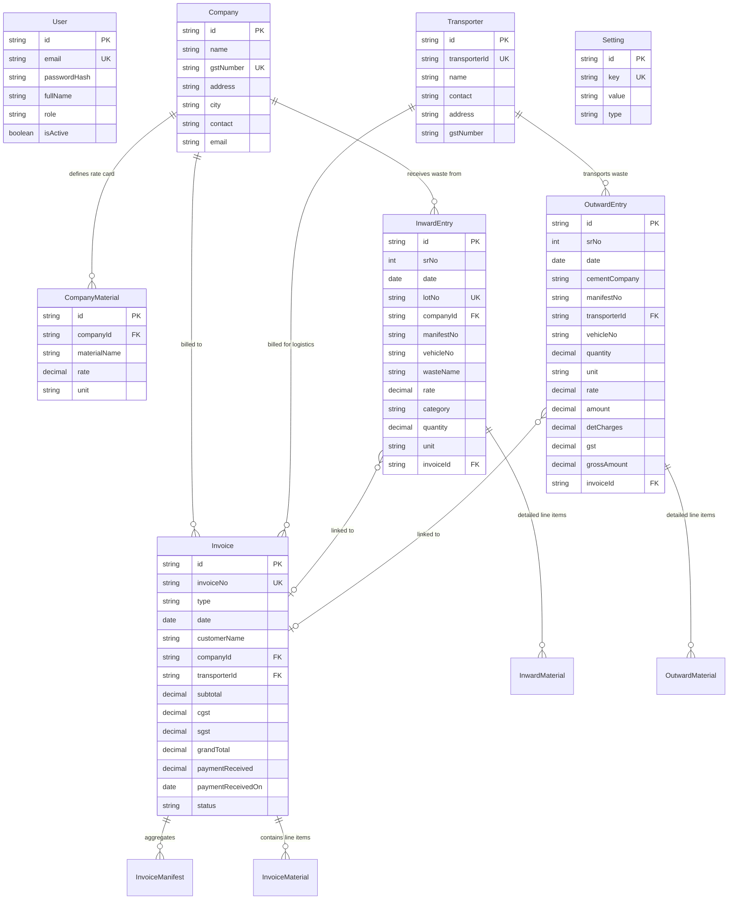
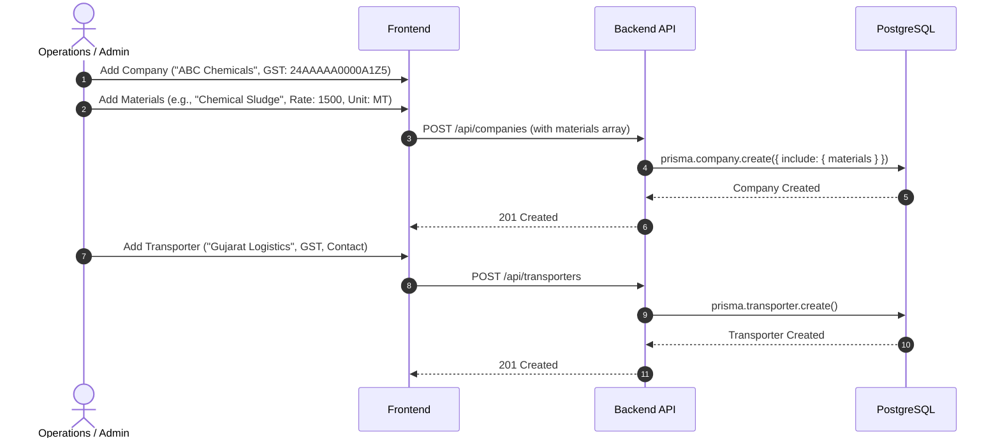
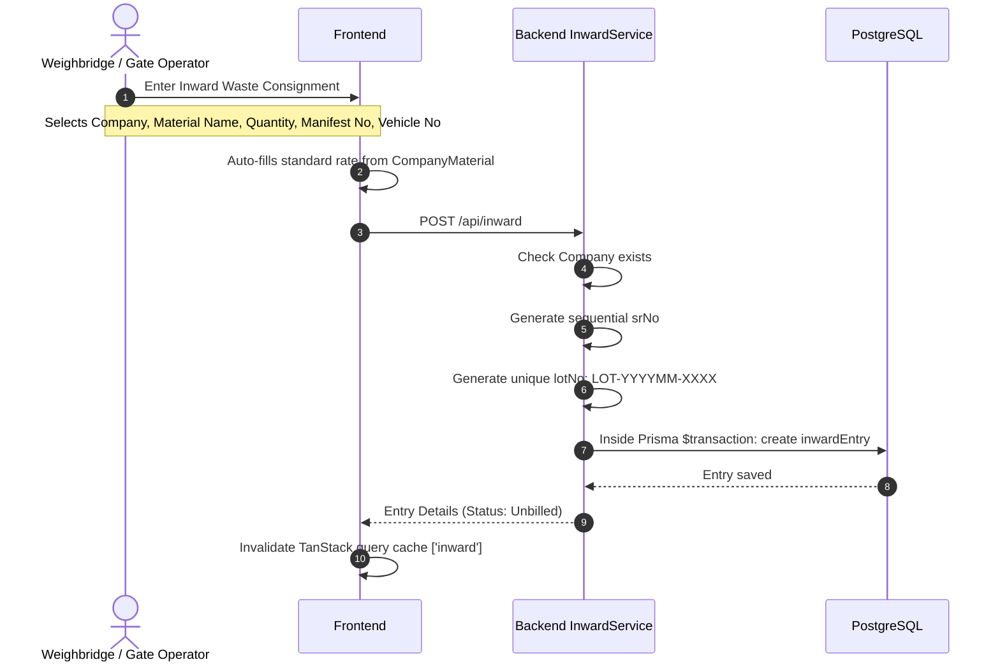
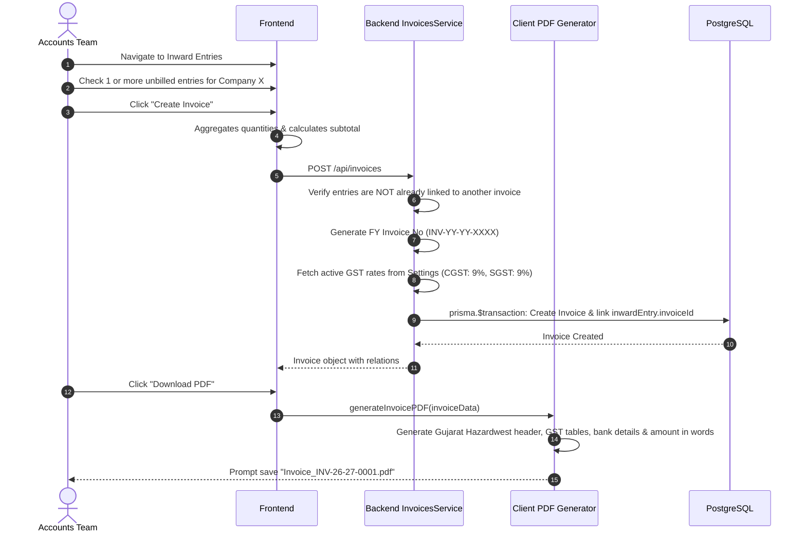
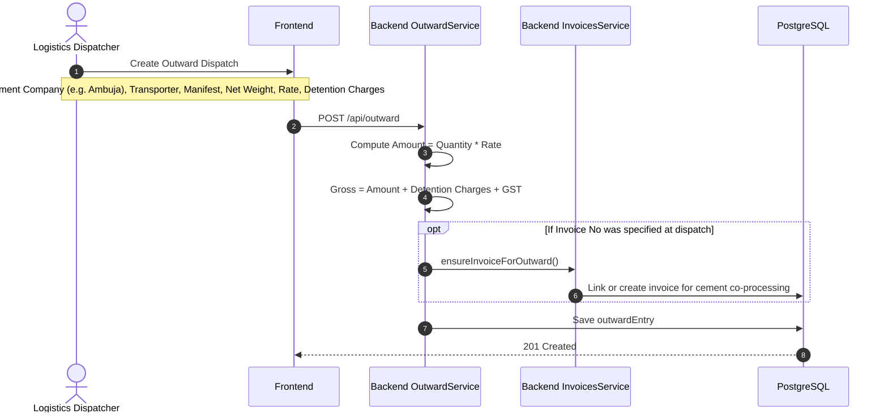

# Gujarat Hazardwest Management Co. (GHMC)
## Complete Technical Architecture, Workflow & Developer Guide

---

## 1. Executive Summary & Core Objective

### 1.1 What is this Project?
This system is an **Enterprise Resource Planning (ERP) & Compliance Platform** built specifically for **Gujarat Hazardwest Management Co. (GHMC)**. The company operates in the hazardous and chemical waste management sector in Gujarat, India.

In this industry, handling industrial hazardous waste is subject to strict environmental regulations (such as PCB/CPCB manifest tracking), complex logistics (transporting hazardous materials safely), and specialized commercial agreements (rate cards per waste material type, detention fees, and Indian GST tax rules).

### 1.2 Main Objectives of the Application
1. **Inward Logistics & Waste Intake Tracking**:
   - Record waste consignments received from client chemical manufacturing companies.
   - Capture critical statutory parameters: **Manifest Numbers**, **Vehicle Numbers**, **Lot Numbers**, **Waste Categories**, **Units**, and **Quantities**.
   - Automatically match pre-agreed waste material rates for each client company.
2. **Outward Logistics & Co-Processing Dispatch**:
   - Track hazardous waste dispatched from the facility to cement manufacturing plants (such as Ambuja, UltraTech, etc.) for high-temperature incineration/co-processing.
   - Record logistics transporters, vehicle capacities, driver detention charges, and dispatch manifests.
3. **Automated Billing & Indian GST Invoicing**:
   - Generate official Tax Invoices for Inward processing fees and Outward dispatch charges.
   - Dynamically compute Subtotals, CGST (9%), SGST (9%), IGST, and Grand Totals.
   - Follow Indian Financial Year sequencing (e.g., `INV-26-27-0001` starting April 1st).
   - Generate pixel-perfect downloadable PDF tax invoices with company letterhead, bank details, and amounts in words (Indian numbering system: Lakhs/Crores).
4. **Financial Reconciliation & Payment Tracking**:
   - Track received payments against invoices.
   - Automatically compute balances and manage statuses: `Pending` ➔ `Partial` ➔ `Paid`.
5. **Operational Analytics**:
   - Provide a real-time dashboard consolidating total tonnage received and dispatched (normalizing Kilograms, Metric Tonnes, and Kilolitres into MT), monthly revenues, and outstanding receivables.

---

## 2. High-Level Architecture

The project is structured as a decoupled, modern full-stack web application:



### 2.1 Technology Stack Summary

| Layer | Technologies Used | Key Libraries & Packages |
|---|---|---|
| **Frontend** | React 18, TypeScript, Vite | Tailwind CSS, Radix UI (via Shadcn), TanStack React Query v5, React Router v6, Axios, Lucide React, jsPDF, jspdf-autotable, date-fns, sonner |
| **Backend** | Node.js (ES Modules), Express | Prisma ORM, PostgreSQL, jsonwebtoken (JWT), bcryptjs, Joi, helmet, cors, compression, express-rate-limit, morgan |
| **Database** | PostgreSQL | Prisma Schema (`backend/prisma/schema.prisma`) |
| **Authentication** | JWT (JSON Web Tokens) | Bearer token stored in `localStorage`, validated per request |

---

## 3. Database Schema & Domain Entity Relationships

The data model is defined in `backend/prisma/schema.prisma`. Below is the entity relationship diagram:



### 3.1 Key Entity Breakdown
- **`User`**: Administrators and Superadmins. Passwords hashed using `bcryptjs`.
- **`Company`**: Clients who produce hazardous waste. Identified by unique GST number.
- **`CompanyMaterial`**: Preset master pricing. When an inward entry is created for Company X with Material Y, the rate is automatically pulled from here.
- **`Transporter`**: Third-party logistics partners who move waste between GHMC and cement plants.
- **`InwardEntry`**: Gate records of incoming waste. Each has an auto-generated serial number (`srNo`) and a monthly lot number (e.g., `LOT-202609-0001`).
- **`OutwardEntry`**: Dispatch records sent to cement kilns. Tracks destination cement company, vehicle numbers, freight, and detention charges.
- **`Invoice`**: The commercial billing document. Ties to either a `Company` (for inward waste treatment) or a `Transporter` (for outward transport). Stores tax splits (`cgst`, `sgst`) and payment reconciliation (`paymentReceived`, `status`).
- **`InvoiceManifest` & `InvoiceMaterial`**: Sub-items and manifests included in an invoice.
- **`Setting`**: System configuration store (e.g., `cgst_rate`, `sgst_rate`, `invoice_number_format`, company address/bank details).

---

## 4. End-to-End Business Workflows

### Workflow 1: Master Data Setup

*Purpose*: Inward and outward entries rely on this master data to auto-populate customer details, rates, and tax identifiers.

---

### Workflow 2: Inward Waste Entry Lifecycle


---

### Workflow 3: Invoicing & Billing Lifecycle


---

### Workflow 4: Outward Entry & Cement Plant Co-Processing


---

### Workflow 5: Payment Tracking & Reconciliation
- Invoices start with status `Pending` (`paymentReceived = 0`).
- When payment is received from a client or paid to a transporter, the user opens the invoice on the **Invoices** page and clicks **Update Payment**.
- The user inputs the amount and the payment date.
- **Backend Logic** in `backend/src/services/invoices.service.js`:
  ```javascript
  const grandTotal = parseFloat(invoice.grandTotal);
  let status = 'Pending';
  if (paymentReceived >= grandTotal) {
    status = 'Paid';
  } else if (paymentReceived > 0) {
    status = 'Partial';
  }
  ```
- The invoice status instantly updates on the UI and is reflected on the **Dashboard** metrics.

---

## 5. Complete Codebase Directory Map

### 5.1 Backend Structure (`/backend`)
```
backend/
├── prisma/
│   └── schema.prisma               # Database schema definition (PostgreSQL)
├── src/
│   ├── app.js                      # Express configuration, middleware, route mounting
│   ├── server.js                   # Server bootstrap & port listener (default: 3000)
│   ├── config/
│   │   ├── database.js             # PrismaClient singleton instance
│   │   └── env.js                  # Environment variables & runtime validation
│   ├── controllers/                # HTTP layer: extracts req params/body, delegates to services
│   │   ├── auth.controller.js
│   │   ├── companies.controller.js
│   │   ├── dashboard.controller.js
│   │   ├── invoices.controller.js
│   │   ├── inward.controller.js
│   │   ├── outward.controller.js
│   │   ├── settings.controller.js
│   │   └── transporters.controller.js
│   ├── services/                   # Business Logic Layer: queries, transactions, calculations
│   │   ├── auth.service.js         # JWT signing, user creation, password verification
│   │   ├── companies.service.js    # Company CRUD & material rate card management
│   │   ├── dashboard.service.js    # Statistics calculation (MT conversion, revenue)
│   │   ├── invoices.service.js     # FY sequence generation, tax calculation, payment updates
│   │   ├── inward.service.js       # Inward entry creation, LOT number sequence generator
│   │   ├── outward.service.js      # Outward entry creation, freight/detention calculation
│   │   ├── settings.service.js     # Key-value system config
│   │   └── transporters.service.js # Transporter fleet & GST profile management
│   ├── middleware/
│   │   ├── auth.middleware.js      # JWT Bearer verification & role check (admin/superadmin)
│   │   ├── error.middleware.js     # Global error catcher & standardized error response
│   │   └── logger.middleware.js    # Request logger
│   ├── seeders/
│   │   ├── admin.seeder.js         # Creates default admin user (admin@ghmcwest.com / admin123)
│   │   └── settings.seeder.js      # Seeds default GST rates & invoice formats
│   └── utils/
│       ├── errors.js               # Custom error classes (NotFoundError, ValidationError, etc.)
│       ├── math.js                 # Decimal rounding & precision handlers
│       └── logger.js               # Structured console logger
```

### 5.2 Frontend Structure (`/frontend`)
```
frontend/
├── src/
│   ├── App.tsx                     # Top-level routing, React Query Provider, Auth Provider
│   ├── main.tsx                    # React DOM entry point
│   ├── index.css                   # Global Tailwind CSS and styling variables
│   ├── lib/
│   │   ├── api.ts                  # Central Axios client with JWT request interceptor & 401 redirect
│   │   └── utils.ts                # Tailwind class merge utility (cn)
│   ├── contexts/
│   │   └── AuthContext.tsx         # User authentication state, token persistence, login/logout
│   ├── pages/                      # Page components
│   │   ├── Login.tsx               # Credentials authentication
│   │   ├── Dashboard.tsx           # Metrics cards, monthly charts, recent transactions
│   │   ├── Companies.tsx           # Company master table, material management dialog
│   │   ├── Inward.tsx              # Inward entries table, new entry modal, create invoice modal
│   │   ├── Outward.tsx             # Outward dispatch table, dispatch modal, invoice generation
│   │   ├── Transporters.tsx        # Transporter master table & registration modal
│   │   ├── Invoices.tsx            # Invoice list, payment tracking modal, PDF download trigger
│   │   └── Settings.tsx            # System settings (GST rates, FY prefix, profile)
│   ├── components/
│   │   ├── auth/ProtectedRoute.tsx # Route guard checking authentication and user roles
│   │   ├── layout/                 # MainLayout, Header (with user menu), Sidebar (navigation)
│   │   ├── common/                 # DataTable (paginated), ConfirmDialog, ErrorBoundary
│   │   └── ui/                     # Shadcn UI primitives (Button, Dialog, Input, Table, etc.)
│   ├── services/                   # API caller services (mirror backend controllers)
│   │   ├── auth.service.ts
│   │   ├── companies.service.ts
│   │   ├── dashboard.service.ts
│   │   ├── invoices.service.ts
│   │   ├── inward.service.ts
│   │   ├── outward.service.ts
│   │   ├── settings.service.ts
│   │   └── transporters.service.ts
│   └── utils/
│       ├── pdfGenerator.ts         # jsPDF tax invoice generator (GHMC official format)
│       ├── export.ts               # CSV export utility for tabular data
│       ├── formatCurrency.ts       # Indian currency formatter (₹ and comma conventions)
│       └── validation.ts           # GSTIN, phone, email, and numeric format validators
```

---

## 6. How the Modules Work Together

```
+-----------------------------------------------------------------------------------+
|                                 MASTER DATA LAYER                                 |
|                                                                                   |
|  [ Companies ]                                                [ Transporters ]    |
|   - Company Profile                                            - Transporter Info |
|   - Waste Materials & Pre-set Rates                             - Vehicle Metadata |
+-------------------------+---------------------------------------------+-----------+
                          |                                             |
                          | (Auto-populates rates)                      | (Assigned to)
                          v                                             v
+-------------------------+-----------+         +-----------------------+-----------+
|      INWARD OPERATIONS              |         |     OUTWARD OPERATIONS            |
|                                     |         |                                   |
| - Receives hazardous waste from     |         | - Dispatches waste to cement kilns|
|   Company                           |         | - Links transporter & vehicle     |
| - Generates LOT-YYYYMM-XXXX         |         | - Records quantity & rate         |
| - Records manifest & vehicle        |         | - Records detention charges       |
+-------------------------+-----------+         +-----------------------+-----------+
                          |                                             |
                          +---------------------+-----------------------+
                                                |
                                                v
+-----------------------------------------------+-----------------------------------+
|                           INVOICING & TAXATION ENGINE                             |
|                                                                                   |
| - Generates Indian Financial Year numbers: INV-YY-YY-XXXX                        |
| - Pulls CGST (9%) and SGST (9%) from Settings table                              |
| - Links Inward / Outward entry IDs to prevent double-billing                     |
| - Client-side PDF generation with exact tax invoice letterhead                    |
+-----------------------------------------------+-----------------------------------+
                                                |
                                                v
+-----------------------------------------------+-----------------------------------+
|                           PAYMENT & RECONCILIATION                                |
|                                                                                   |
| - Records payments received / paid                                                |
| - Auto-updates Status: Pending -> Partial -> Paid                                 |
| - Feeds real-time financial stats to the Dashboard                                |
+-----------------------------------------------------------------------------------+
```

---

## 7. Developer's Code Modification Guide ("When You Change Code...")

Follow these precise rules and workflows whenever you modify or extend this system:

### Rule 1: Adding a New Field to an Existing Entity (e.g., adding `driverPhone` to `InwardEntry`)
1. **Database Schema**:
   - Open [backend/prisma/schema.prisma](file:///e:/Codes/GHMC/backend/prisma/schema.prisma).
   - Add the field: `driverPhone String? @map("driver_phone")`.
   - Run migration:
     ```bash
     cd backend
     npx prisma migrate dev --name add_driver_phone_to_inward
     npx prisma generate
     ```
2. **Backend Service & Controller**:
   - Open [backend/src/services/inward.service.js](file:///e:/Codes/GHMC/backend/src/services/inward.service.js).
   - In `createEntry(entryData)` and `updateEntry(entryId, entryData)`, destructure `driverPhone` and include it in the `prisma.inwardEntry.create` / `update` call.
   - If search needs to include it, add `{ driverPhone: { contains: search, mode: 'insensitive' } }` to the `OR` conditions.
3. **Frontend Service & Types**:
   - Open [frontend/src/services/inward.service.ts](file:///e:/Codes/GHMC/frontend/src/services/inward.service.ts).
   - Add `driverPhone?: string;` to `InwardEntry` and `CreateInwardEntryDto`.
4. **Frontend Form & Table**:
   - Open [frontend/src/pages/Inward.tsx](file:///e:/Codes/GHMC/frontend/src/pages/Inward.tsx).
   - Add input field in the create/edit Dialog.
   - Add table column if you want it displayed in the list.

### Rule 2: Invalidation of TanStack Query Caches
Whenever you perform a **mutation** (create, update, delete) on the frontend, you must invalidate the corresponding TanStack query key. Otherwise, the UI will display stale data.
- Inward entries: `queryClient.invalidateQueries({ queryKey: ['inward'] })`
- Outward entries: `queryClient.invalidateQueries({ queryKey: ['outward'] })`
- Invoices: `queryClient.invalidateQueries({ queryKey: ['invoices'] })`
- Companies: `queryClient.invalidateQueries({ queryKey: ['companies'] })`
- Transporters: `queryClient.invalidateQueries({ queryKey: ['transporters'] })`
- Dashboard metrics: `queryClient.invalidateQueries({ queryKey: ['dashboard'] })`

### Rule 3: Handling Numeric Precision & Currency
- In the backend, monetary fields and quantities are stored as Prisma `Decimal` with `@db.Decimal(10, 2)`.
- Always use the helper in [backend/src/utils/math.js](file:///e:/Codes/GHMC/backend/src/utils/math.js) (`roundValue(val)`) before persisting calculated amounts to prevent floating-point calculation bugs.
- In the frontend, format all displayed currency using `formatCurrency(val)` from [frontend/src/utils/formatCurrency.ts](file:///e:/Codes/GHMC/frontend/src/utils/formatCurrency.ts).

### Rule 4: Preserving Database Transactions
- Critical operations (such as generating an invoice and linking multiple inward entries, or generating a sequential `srNo` and `lotNo`) **must** be executed inside `prisma.$transaction(async (tx) => { ... })`.
- Never split multi-record billing updates into separate unawaited queries.

### Rule 5: Modifying Invoices or PDF Layouts
- The PDF is generated in the browser using `jspdf` and `jspdf-autotable` inside [frontend/src/utils/pdfGenerator.ts](file:///e:/Codes/GHMC/frontend/src/utils/pdfGenerator.ts).
- If you add fields to invoices (e.g. Purchase Order numbers, extra tax lines, or remarks), you must update `generateInvoicePDF()` to include the new table columns or metadata blocks.

---

## 8. Common Developer Commands & Operations

### 8.1 Running Locally
```bash
# Terminal 1: Backend
cd backend
npm install
npm run dev
# Backend starts at: http://localhost:3000

# Terminal 2: Frontend
cd frontend
npm install
npm run dev
# Frontend starts at: http://localhost:8080 (or http://localhost:5173)
```

### 8.2 Database Management
```bash
cd backend

# View/Edit database records via graphical interface
npm run studio

# Create a new migration after schema changes
npm run migrate

# Seed default administrator user
npm run seed:admin

# Seed default settings (GST rates, FY formats)
npm run seed:settings
```

### 8.3 Default Authentication Credentials
- **Email**: `admin@ghmcwest.com` (or `admin@chemwaste.com`)
- **Password**: `admin123`
*(Note: Change password after first production login via the Settings page)*

---

## 9. Deployment Architecture
- **Backend**: Hosted on Render / Hostinger VPS using Node.js (`src/server.js`).
- **Frontend**: Built using `npm run build` and hosted on Vercel or served as static assets via Nginx on Hostinger.
- **Automated Deployment**: See [deploy.sh](file:///e:/Codes/GHMC/deploy.sh) in the root directory for the automated git pull, build, and PM2 reload sequence.
